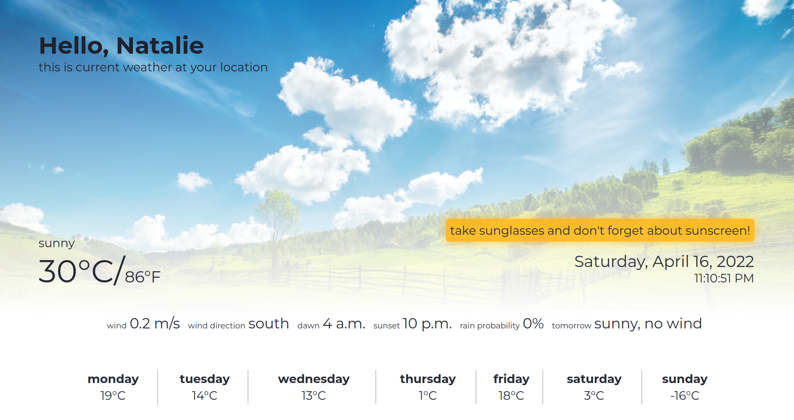

# weather-dashboard-vanilla-js
vanilla js project for revising some knowledge of js and css

 - made with request mocks
 - vanilla js / html / css
 - grid

## dashboard example ↓

TODOS:
 - animated background
 - weather by hour chart
 - location map
 - load data from API (add backend part)
